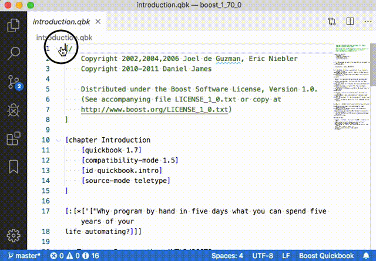
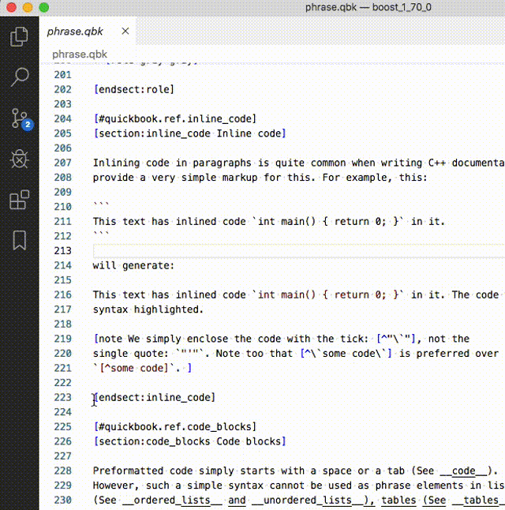

# Boost Quickbook Support Extension

From the [Boost.Quickbook](http://www.boost.org/doc/html/quickbook.html) website:
> QuickBook is a WikiWiki style documentation tool geared towards C++ documentation using simple rules and markup for simple formatting tasks. 

This [Visual Studio Code](https://code.visualstudio.com/) extension provide some simple language support to ease the task of authoring [Boost.Quickbook](http://www.boost.org/doc/html/quickbook.html)(source) files.

It is *not* endorsed, published, approved or peer-reviewed by the [Boost](https://boost.org) community,
or anybody represented by the community. I have simply written it for myself to use - and put it out in the ether in case somebody else may find it useful too.

It is called "Boost Quickbook Support" because *Quickbook* is a [Boost](https://boost.org)-published language/tool,
and when I google "Quickbook" on its own, the search engine assumes I mean accounting software.

- The GitHub repository lives here: [github.com/JBouwer/boost-quickbook-support](https://github.com/JBouwer/boost-quickbook-support)

## Features

- Syntax colouring
- Bracket/Quote matching
- Code folding  
  


- Simple preview generation  


## Requirements

For the preview feature to work, you need a `quickbook` executable - either accessible within your `$PATH`,
or explicitly specified in the `quickbook.preview.pathToExecutable` setting.

## Extension Settings

The executable command options (see `quickbook --help`) are represented by equivalent *settings*. 
Consult the [documentation](http://www.boost.org/doc/html/quickbook.html) for appropriate usage.

In addition, all filesystem paths can be specified relative to the *workspace directory*;  
These settings are processed as follows:  
1. The specified path is quoted and tested as is - if it exists, it is used.
1. Otherwise the specified path is prepended in turn by each of the workspace directories - if it exists, it is used.
1. Otherwise the specified path is used as specified.

Also note that to use local filesystem resources (e.g. `CSS` file, or _Boost_ directory), 
prepend each with a `vscode-resource:` scheme;  
e.g. `vscode-resource:/path/to/my/css_file.css`.  

Also see [Security](#Security) below for more on this, and related settings.

## Security
The [WebView API documentation](https://code.visualstudio.com/api/extension-guides/webview) component
used to generate the preview panel are very restrictive with regards to what content can be displayed.
In short:
- Any external media needs to be explicitly _trusted_ with the _"Content Security Policy"_.
- Local media:
    - Needs to be accessed with a special `vscode-resource:` scheme.
    - The scheme also needs to be explicitly _trusted_ with the _"Content Security Policy"_.
    - The root directories that contain local media, need to be explicitly _trusted_, by adding them to 
      [`WebviewOptions`](https://code.visualstudio.com/api/references/vscode-api#WebviewOptions)`.localResourceRoots`.

See the  [WebView API documentation](https://code.visualstudio.com/api/extension-guides/webview#loading-local-content) for more on this subject.

This extension provides the following features to accommodate the above requirements.
- The "Content-Security-Policy" can be adjusted with the `quickbook.preview.security.contentSecurityPolicy` setting.  
  The setting results into the `CSP` part of the
  [`<meta http-equiv=\"Content-Security-Policy\" content=\"CSP\">`](https://developers.google.com/web/fundamentals/security/csp/) directive,
  and is injected into the preview HTML, before displaying it in the `Webview`.  
  > This setting defaults to "`vscode-resource:`" (needed to access local media).

- The extension can temporarily adjust _local_ image URI's (i.e. Quickbook `[$ ...] directives) for display in the preview:
    - The `quickbook.preview.security.processImagePathScheme` setting (defaulting to `true`),
      will temporarily adjust the scheme to "`vscode-resource:`".
    - The `quickbook.preview.security.processImagePathRelative` setting (defaulting to `true`),
      will temporarily root _relative_ image paths to the directory of the source Quickbook file
      (i.e. the file that is being _previewed_).

- The following settings will add their respected directories to the trusted list ([`WebviewOptions`](https://code.visualstudio.com/api/references/vscode-api#WebviewOptions)`.localResourceRoots`):
    - `quickbook.preview.security.trustSourceFileDirectory`:  
      When enabled (default), the directory of the source file (i.e. the file being previewed) is trusted.
    - `quickbook.preview.security.trustWorkspaceDirectories`:  
      When enabled (default), all of the workspace directories are trusted.
    - `quickbook.preview.security.trustSpecifiedDirectories`:  
      When enabled (default), any directory-paths specified in the settings above, are trusted.
      This includes the paths specified under `quickbook.preview.`: i.e. 
      `boostRootPath`, `CSSPath`, `graphicsPath`, `imageLocation` & `include.path/workspacePath`.
    - `quickbook.preview.security.trustAdditionalDirectories`:  
      An array of additional paths to trust.

## Known Issues

This extension is not bullet proof. It is only intended as the next step up from a pure text editor - not as a *complete documentation writing tool*.

Currently it suffers from the following caveats.
See the [GitHub Issues Page](https://github.com/JBouwer/boost-quickbook-support/issues) for more.

- Bracket & Quote matching does *not* recognise escaped characters:
e.g.  
    ```[myTemplate includes a \] character]```  
    does not match correctly on the last `]`.  
    #### Explanation
    The current 
    [bracket matching](https://code.visualstudio.com/api/language-extensions/language-configuration-guide#brackets-definition)
    is simply specified inside the `language-configuration.json` file.
    I don't know how to do specify the concept of an *escaped* character in there - if possible at all.  

## FAQ
Some answers to potential problems can be found [here](FAQ.md).

## Release Notes

### 0.0.4
- Modified settings functionality to reload with every _preview_ operation (no more _Reload Window_ necessary).
- Added _Content Security Policy_, (Issue #3), and associated `quickbook.preview.security.contentSecurityPolicy` setting.
- Seemingly fixed Issue #2, with support for `CSS` file setting, support graphics & user-images.
    > Note that:
    > - At the time of writing I needed to set my _Graphics Path_ setting to:
    > `vscode-resource:/BOOST_PATH/doc/src/images/` for Boost graphics to resolve to the correct path - setting
    > the _Boost Root Directory_ was not adequate.
- Explicit _trusting_ of local directories for preview (See [Security](#Security) above.)

### 0.0.3
- Fixed Comments that surround template expansion (and other comment) patterns.
- Preview panel now with buttons & menu items:
    - Refresh
    - View Source
    - Preview to the side
- Command palette now ignoring invalid entries

### 0.0.2
- Minor documentation & naming issues fixed.

### 0.0.1

Initial release.

