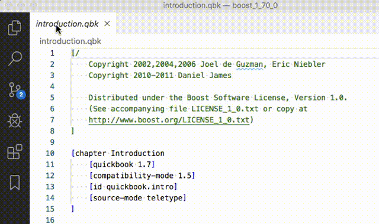

# Boost Quickbook Support Extension

From the [Boost.Quickbook](http://www.boost.org/doc/html/quickbook.html) website:
> QuickBook is a WikiWiki style documentation tool geared towards C++ documentation using simple rules and markup for simple formatting tasks. 

This [Visual Studio Code](https://code.visualstudio.com/) extension provide some simple language support to ease the task of authoring [Boost.Quickbook](http://www.boost.org/doc/html/quickbook.html)(source) files.

It is *not* endorsed, published, approved or peer-reviewed by the [Boost](https://boost.org) community,
or anybody represented by the community. I have simply written it for myself to use - and put it out in the ether in case somebody else may find it useful too.

It is called "Boost Quickbook Support" because *Quickbook* is a [Boost](https://boost.org)-published language/tool,
and when I google "Quickbook" on its own, the search engine assumes I mean accounting software.

- The GitHub repository lives here: [github.com/JBouwer/boost-quickbook-support](https://github.com/JBouwer/boost-quickbook-support)

## Features

- Syntax colouring
- Bracket/Quote matching
- Code folding  
  


- Simple preview generation  


## Requirements

For the preview feature to work, you need a `quickbook` executable - either accessible within your `$PATH`,
or explicitly specified in the `quickbook.preview.pathToExecutable` setting.

## Extension Settings

The executable command options (see `quickbook --help`) are represented by equivalent *settings*. 
Consult the [documentation](http://www.boost.org/doc/html/quickbook.html) for appropriate usage.

In addition, all filesystem paths can be specified relative to the *workspace directory*;  
These settings are processed as follows:  
1. The specified path is quoted and tested as is - if it exists, it is used.
1. Otherwise the specified path is prepended in turn by each of the workspace directories - if it exists, it is used.
1. Otherwise the specified path is used as specified.

Also note that:
* If they exist, the following local filesystem directories (and subdirectories) are trusted, 
  and added to the `localResourceRoots` of the preview `Webview`:
    * The directory of the input file.
    * All settings-specified paths.
* To use local filesystem resources (e.g. `CSS` file, or _Boost_ directory), 
  prepend each with a `vscode-resource:` scheme;  
  e.g. `vscode-resource:/path/to/my/css_file.css`.  
  See the  [WebView API documentation](https://code.visualstudio.com/api/extension-guides/webview#loading-local-content) for more on this subject.

## Known Issues

This extension is not bullet proof. It is only intended as the next step up from a pure text editor - not as a *complete documentation writing tool*.

Currently it suffers from the following caveats.
See the [GitHub Issues Page](https://github.com/JBouwer/boost-quickbook-support/issues) for more.

- Bracket & Quote matching does *not* recognise escaped characters:
e.g.  
    ```[myTemplate includes a \] character]```  
    does not match correctly on the last `]`.  
    #### Explanation
    The current 
    [bracket matching](https://code.visualstudio.com/api/language-extensions/language-configuration-guide#brackets-definition)
    is simply specified inside the `language-configuration.json` file.
    I don't know how to do specify the concept of an *escaped* character in there - if possible at all.  

- The *preview* panel does not correctly display user-images.

## FAQ
Some answers to potential problems can be found [here](FAQ.md).

## Release Notes

### 0.0.4
- Added _Content Security Policy_, (Issue #3), and associated `quickbook.preview.security.contentSecurityPolicy` setting.
- Modified settings functionality to reload with every _preview_ operation (no more _Reload Window_ necessary).
- Partially fixed Issue #2, with support for `CSS` file setting & support graphics (not user-images).
    > Note that at the time of writing I needed to set the _Graphics Path_ setting to:
    > `vscode-resource:/BOOST_PATH/doc/src/images/` for this to work correctly - setting the _Boost Root Directory_
    > only did not resolve to the correct image directory.

### 0.0.3
- Fixed Comments that surround template expansion (and other comment) patterns.
- Preview panel now with buttons & menu items:
    - Refresh
    - View Source
    - Preview to the side
- Command palette now ignoring invalid entries

### 0.0.2
- Minor documentation & naming issues fixed.

### 0.0.1

Initial release.

